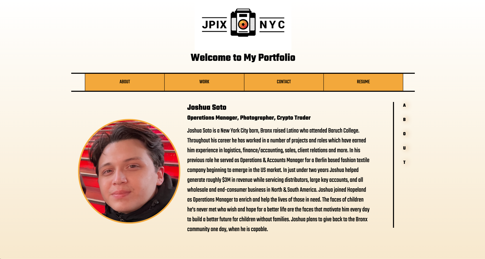

# portfolio-page

##Installation

To use the website simply vist [its page](https://fewb92.github.io/portfolio-page/)

Alternatively, visit the [project repository](https://github.com/fewb92/portfolio-page)

##About This Project

This project is a simple portfolio website made with HTML and CSS, produced entirely from scratch.

The site is designed to include an 'About Me' section, as well as 'Contact,' and 'Work' sections. The site also allows the user to visit a copy of Josh Soto's resume. The site has incorporated responsive design to accomodate different browser widths and usecases.

Any questions about the project can be addressed to Josh Soto via Direct message at the Instagram or Twitter links on the contact section of the page. Questions can also be directed to [Josh's email](josh@jpix.nyc)